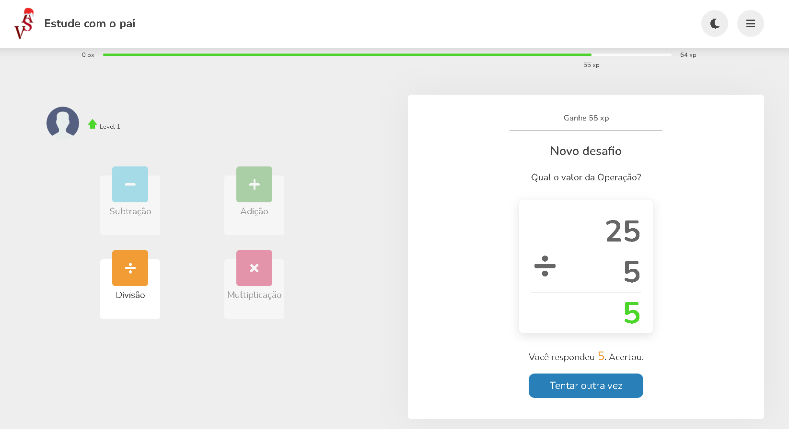

<p align="center">
  
</p>

<h2 align="center">Tópicos 📋</h2>

   <p>
   
   - [Sobre 📖](#sobre-)
   - [Layout 🎨](#layout-)
   - [Como Usar 🤔](#como-usar-)
   - [Autor 🎓](#autor)

   </p>

---

<h2 align="center">Sobre 📖</h2>
   
<p>
   O projeto Study With Father foi desenvolvido para desafiar as pessoas nas operções básicas da matemáica, são calculos simples que pode estimular o aprendizado da materia. 
</p>

---

<h2 align="center">Layout 🎨</h2>

   <p align="center">
      
   </p>

   <p align="center">
      Para visualizar a aplicação em funcionamento basta seguir o link:
   
   - <a href="https://studywithfather.vercel.app/">Study With Father </a> 📱
   </p>

---

```
- Clone esse repositório:
$ git clone https://github.com/valdir-alves3000/studywithfather
- Entre no diretório:
$ cd studywithfather
- Instale as dependências:
$ npm install
# or
yarn install
- Inicie o app:
$ npm run dev
# or
yarn dev
```

---

<h3 id="autor" align="center"> Autor </h3>

<a href="https://github.com/valdir-alves3000/">
 
 <br />
 <sub style="margin-right: 1rem;"><b>Valdir Alves </b></sub>🚀</a>

<p style="margin-top: 0.5rem;">Feito com ❤️ por Valdir Alves. Entre em contato!</p>

[](http://linkedin.com/in/valdiralves3000)
[](mailto:valdiralves3000@gmail.com)
